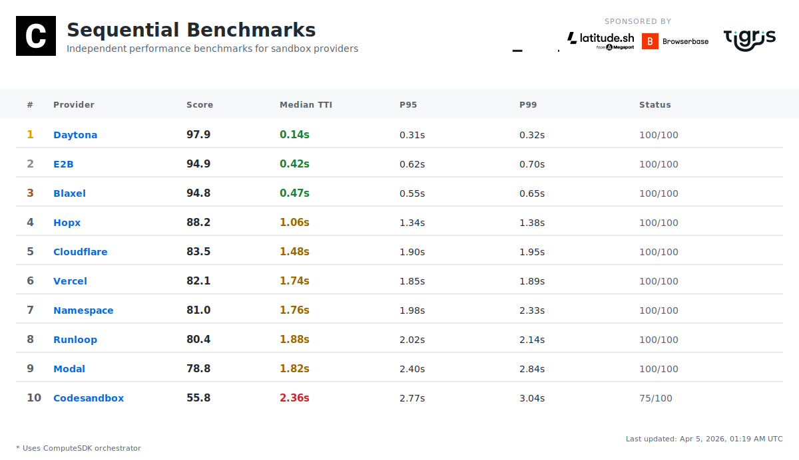

[](https://github.com/computesdk/benchmarks/actions/workflows/benchmarks.yml)
[](./LICENSE)

**TTI (Time to Interactive)** = API call to first command execution. Lower is better.

<br>

## What We Measure

**Daily: Time to Interactive (TTI)**

```
API Request → Provisioning → Boot → Ready → First Command
└───────────────────── TTI ─────────────────────┘
```

Each benchmark creates a fresh sandbox, runs `echo "benchmark"`, and records wall-clock time. 10 iterations per provider, every day, fully automated.

**Powered by ComputeSDK** — We use [ComputeSDK](https://github.com/computesdk/computesdk), a multi-provider SDK, to test all sandbox providers with the same code. One API, multiple providers, fair comparison. Interested in multi-provider failover, sandbox packing, and warm pooling? [Check out ComputeSDK](https://github.com/computesdk/computesdk).

**Sponsor-only tests coming soon:** Stress tests, warm starts, multi-region, and more. [See roadmap →](#roadmap)

[Full methodology →](./METHODOLOGY.md)

<br>

## Benchmark Your Workloads

You can benchmark real project commands (for example setup + test/build) in addition to TTI.

### 1) Use a workload file

```bash
npm run bench -- \
  --provider namespace \
  --iterations 3 \
  --workload-file workloads/islo-frontend-build.json
```

Template file for custom repos: `workloads/islo-template.json`.

### 2) Pass commands directly

```bash
npm run bench -- \
  --provider e2b \
  --iterations 3 \
  --setup-cmd 'git clone --depth 1 https://github.com/your-org/your-repo.git /workspace/repo && cd /workspace/repo && npm ci' \
  --workload-cmd 'cd /workspace/repo && npm test' \
  --workload-name 'repo test run' \
  --workload-timeout-ms 300000
```

### Workload flags

- `--workload-file <path>` JSON file with `name`, `setupCommand`, `command`, `cwd`, `timeoutMs`
- `--setup-cmd "<command>"` optional prep command
- `--workload-cmd "<command>"` optional workload command
- `--workload-name "<name>"` label shown in logs
- `--workload-cwd "<path>"` working directory inside sandbox
- `--workload-timeout-ms <ms>` timeout per setup/workload command

Results still include standard TTI metrics, plus workload and total timing when workload mode is used.

<br>

## Evaluate ISLO.dev

You can benchmark ISLO directly by adding `ISLO_*` vars to `.env` (see `env.example`) and running:

```bash
npm run bench:islo -- --iterations 5
```

To benchmark an ISLO-hosted workload:

```bash
npm run bench:islo -- \
  --iterations 3 \
  --workload-file workloads/islo-frontend-build.json
```

If your token is an operator/admin token, also set `ISLO_PUBLIC_TENANT_ID` (and optionally `ISLO_PUBLIC_USER_ID`) so requests are scoped to a tenant.

<br>

## Transparency

- 📖 **Open source** — All benchmark code is public
- 📊 **Raw data** — Every result committed to repo
- 🔁 **Reproducible** — Anyone can run the same tests
- ⚙️ **Automated** — Daily at 5pm Pacific (00:00 UTC) via GitHub Actions on Namespace runners
- 🛡️ **Independent** — Sponsors cannot influence results

<br>

## Sponsors

Sponsors fund large-scale infrastructure tests. **Sponsors cannot influence methodology or results.**

[Become a sponsor →](./SPONSORSHIP.md)

<br>

## Roadmap

- [ ] benchmarks.computesdk.com
- [ ] 10,000 concurrent sandbox stress test
- [ ] Cold start vs warm start metrics
- [ ] Multi-region testing
- [ ] Cost-per-sandbox-minute

<br>

---

MIT License
